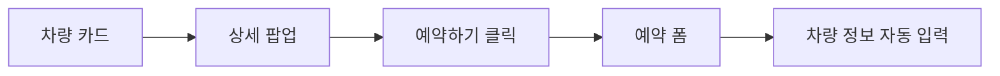
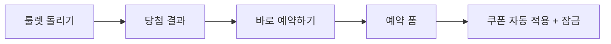

# 차렌터카 예약 시스템 개선 전략

## 📋 목표

사용자가 편리하게 차량을 예약할 수 있도록 직관적이고 간편한 예약 프로세스 구축

---

## 🎯 주요 개선 사항

### 1. 통합 예약 폼 시스템 🚗

#### 기능 요구사항

- **원스톱 예약**: 한 화면에서 모든 예약 정보 입력 가능
- **단계별 입력**: 툭툭 클릭하면서 자연스럽게 입력
- **실시간 피드백**: 입력 시 즉시 유효성 검사
- **자동 완성**: 이전 예약 정보 불러오기 (로그인 시)

#### UI/UX 설계

```
[예약 폼 구조]
1단계: 차량 정보 (자동 입력 또는 선택)
2단계: 대여 기간 (캘린더 + 시간 선택)
3단계: 개인 정보
4단계: 쿠폰 적용 (있을 경우 자동 적용)
5단계: 최종 확인 및 결제
```

#### 필수 입력 항목

- [ ] 차량 선택 (자동 입력 가능)
- [ ] 대여 시작일/종료일
- [ ] 시간 선택
- [ ] 이름
- [ ] 연락처
- [ ] 면허증 정보
- [ ] 쿠폰 코드 (선택)
- [ ] 추가 요청사항

---

### 2. 차량 갤러리 → 예약 연동 🔗

#### 시나리오

```
차량 카드 클릭
  → 상세 팝업 열림
  → 실제 사진 + 영상 확인
  → "예약하기" 버튼 클릭
  → 예약 폼으로 이동 (차량 정보 자동 입력)
```

#### 구현 방안

- **URL 쿼리 파라미터 사용**
  ```
  /reservation?vehicle=carnival_van&vehicleName=기아%20카니발
  ```
- **상태 관리 (Context API 또는 Zustand)**
  ```typescript
  {
    selectedVehicle: {
      id: 'carnival_van',
      name: '기아 카니발',
      price: { daily: 120000, monthly: 2800000 }
    }
  }
  ```

#### 기대 효과

- ✅ 사용자가 차량 정보를 다시 선택할 필요 없음
- ✅ 즉시 예약 가능 (전환율 향상)
- ✅ 매끄러운 사용자 경험

---

### 3. 룰렛 이벤트 → 예약 연동 🎰

#### 시나리오

```
룰렛 돌리기
  → 쿠폰 당첨!
  → "바로 예약하기" 버튼 클릭
  → 예약 폼으로 이동 (쿠폰 정보 자동 적용 + 잠금)
```

#### 쿠폰 데이터 구조

```typescript
interface Coupon {
  id: string;
  code: string;
  type: "discount_percent" | "discount_amount" | "free_upgrade";
  value: number;
  description: string;
  expiryDate: Date;
  isLocked: boolean; // 룰렛에서 온 경우 true
}
```

#### 구현 방안

1. **쿠폰 정보 전달**

   ```
   /reservation?coupon=LUCKY2025&couponValue=20000&locked=true
   ```

2. **예약 폼에서 처리**

   - 쿠폰 필드 자동 입력
   - 쿠폰 변경 불가 (locked=true)
   - 할인 금액 실시간 반영
   - 만료일 표시

3. **UI 표시**
   ```
   🎉 룰렛 이벤트 당첨 쿠폰이 적용되었습니다!
   [LUCKY2025: 20,000원 할인] 🔒 (변경 불가)
   ```

#### 예외 처리

- 쿠폰 중복 사용 방지
- 쿠폰 유효기간 체크
- 최소 결제 금액 확인

---

## 📱 예약 폼 세부 설계

### 입력 필드 구성

#### 1단계: 차량 정보

```typescript
{
  vehicleId: string; // 자동 입력 (갤러리/룰렛에서 온 경우)
  vehicleName: string;
  vehicleImage: string;
  dailyRate: number;
  monthlyRate: number;
}
```

- 갤러리에서 온 경우: 차량 정보 표시 + 변경 가능
- 일반 진입: 차량 선택 드롭다운

#### 2단계: 대여 기간

```typescript
{
  startDate: Date;
  endDate: Date;
  startTime: string; // "09:00", "14:00" 등
  endTime: string;
  rentalType: "daily" | "monthly";
}
```

- 캘린더 UI (react-datepicker)
- 시간 선택 (드롭다운)
- 일일/월렌트 자동 계산

#### 3단계: 고객 정보

```typescript
{
  name: string;
  phone: string;
  email: string;
  licenseNumber: string;
  birthDate: string;
}
```

- 전화번호 자동 포맷팅 (010-1234-5678)
- 이메일 유효성 검사
- 면허증 번호 형식 검증

#### 4단계: 쿠폰 & 옵션

```typescript
{
  coupon?: {
    code: string;
    discount: number;
    isLocked: boolean;
  };
  options: {
    insurance: boolean;    // 보험
    babySeat: boolean;     // 카시트
    navigation: boolean;   // 네비게이션
  };
  specialRequest: string;  // 특별 요청사항
}
```

#### 5단계: 최종 확인

```
[차량 정보 요약]
기아 카니발 (9인승)

[대여 기간]
2025-01-20 09:00 ~ 2025-01-25 18:00 (5일)

[요금 계산]
일일 요금: 120,000원 × 5일 = 600,000원
옵션: 30,000원
─────────────────
소계: 630,000원
쿠폰 할인: -20,000원 🎉
─────────────────
최종 금액: 610,000원

[개인정보]
홍길동 (010-1234-5678)

[약관 동의]
☑ 개인정보 처리방침 동의
☑ 대여 약관 동의

[예약하기] 버튼
```

---

## 🔄 데이터 흐름

### 차량 갤러리 → 예약



### 룰렛 → 예약



---

## 🎨 UI/UX 개선 포인트

### 사용자 친화적 디자인

1. **진행 상태 표시**

   - 상단에 단계 표시 (1/5 → 2/5 → ...)
   - 완료된 단계는 체크 표시

2. **실시간 가격 계산**

   - 오른쪽에 고정된 요금 요약 카드
   - 입력할 때마다 실시간 업데이트

3. **에러 처리**

   - 입력 실패 시 친절한 안내
   - 필수 항목 미입력 시 해당 필드로 스크롤

4. **모바일 최적화**
   - 터치 친화적 버튼 크기
   - 키보드 자동 타입 (숫자/이메일 등)
   - 풀스크린 모달

---

## 🛠️ 기술 스택 제안

### Frontend

- **Form 관리**: React Hook Form
- **유효성 검사**: Zod 또는 Yup
- **날짜 선택**: react-datepicker
- **상태 관리**: Zustand 또는 Context API
- **스타일링**: Tailwind CSS

### Backend (필요 시)

- **예약 API**: Next.js API Routes
- **DB**: Supabase 또는 Firebase
- **결제**: 토스페이먼츠 또는 KG이니시스

---

## 📊 우선순위

### Phase 1 (필수)

- [ ] 통합 예약 폼 UI 구현
- [ ] 차량 갤러리 → 예약 연동
- [ ] 기본 유효성 검사

### Phase 2 (중요)

- [ ] 룰렛 → 예약 연동 (쿠폰 자동 적용)
- [ ] 실시간 가격 계산
- [ ] 모바일 최적화

### Phase 3 (개선)

- [ ] 백엔드 연동 (실제 예약 저장)
- [ ] 이메일/SMS 알림
- [ ] 예약 내역 조회
- [ ] 관리자 대시보드

---

## 💡 추가 아이디어

### 1. 빠른 예약 (Quick Booking)

- 인기 차량 + 내일/주말 바로 예약
- 원클릭 예약 (로그인 사용자)

### 2. 카카오톡 연동

- 카카오톡으로 예약 확인서 발송
- 카카오페이 결제 연동

### 3. 찜하기 기능

- 마음에 드는 차량 저장
- 나중에 다시 예약

### 4. 비교하기

- 여러 차량 한눈에 비교
- 가격/스펙/옵션 비교표

---

## 📝 참고 사항

### 법적 요구사항

- [ ] 개인정보 처리방침
- [ ] 차량 대여 약관
- [ ] 취소/환불 정책
- [ ] 보험 약관

### 고객 안내

- [ ] 자주 묻는 질문 (FAQ)
- [ ] 대여 절차 안내
- [ ] 연락처 (전화/카카오톡)
- [ ] 오시는 길

---

## 🎯 성공 지표 (KPI)

1. **예약 전환율**: 상세 페이지 → 예약 완료
2. **평균 예약 시간**: 첫 클릭 → 예약 완료까지 시간
3. **이탈률**: 각 단계별 이탈률 측정
4. **쿠폰 사용률**: 룰렛 쿠폰 → 실제 예약
5. **모바일 vs 데스크톱**: 디바이스별 전환율

---

**작성일**: 2025-01-16  
**최종 수정**: 2025-01-16  
**담당**: 개발팀

---

## 다음 단계

1. ✅ 전략 문서 작성 완료
2. ⏳ 예약 폼 와이어프레임 작성
3. ⏳ 컴포넌트 구조 설계
4. ⏳ API 스펙 정의
5. ⏳ 개발 시작
